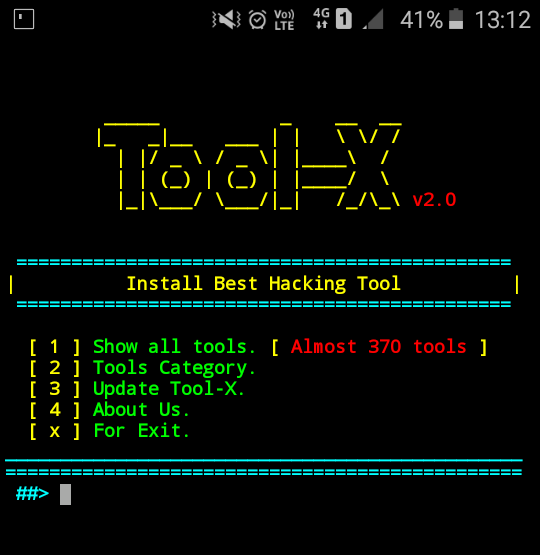
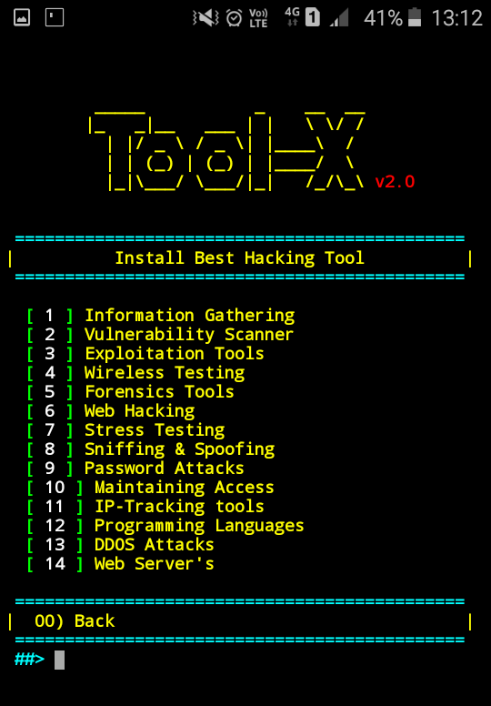

# HatanToolX

---

### Introduction

*HatanToolX is a Kali Linux hacking tools installer for Termux and linux system.*
HatanToolX was developed for Termux and other android terminals. Using HatanToolX, you can install almost 370+ hacking tools in Termux (android) and other Linux based distributions. Now HatanToolX is available for Ubuntu, Debian etc.

 

---

### Operating System Requirements

HatanToolX works on any of the following operating systems: 
• **Android** (Using the Termux App)  
• **Linux** (Debian Based Systems)  

---

### How to Install

Open the terminal and type following commands.
(افتح الطرفية واكتب الأوامر التالية.)

* **`apt update`**
  (لتحديث قائمة الحزم في نظامك.)

* **`apt install git`**
  (لتثبيت أداة Git اللازمة لنسخ المشروع.)

* **`git clone https://github.com/hatanhack/HatanToolX.git`**
  (لنسخ ملفات أداة HatanToolX من GitHub إلى جهازك.)

* **`cd HatanToolX`**
  (للدخول إلى مجلد الأداة بعد نسخها.)

* **`python3 install.py`**
  **(لتشغيل سكريبت التثبيت. هذا السكريبت سيقوم بإنشاء المجلدات ونسخ الملفات وتجهيز الأداة بشكل كامل.)**

---

### تشغيل الأداة (Running the Tool)

بعد اكتمال التثبيت بنجاح، يمكنك تشغيل الأداة من أي مكان بكتابة اسمها المختصر:

* **`hatantoolx`**
  (لتشغيل الأداة مباشرة.)
